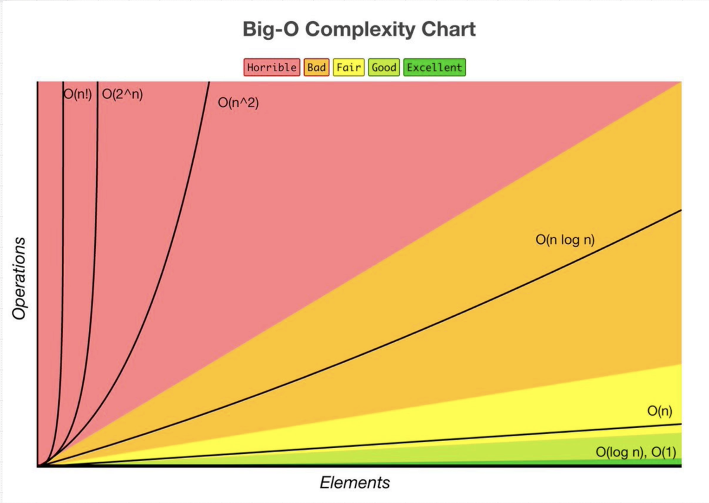

# Big O notation

By [Sobhi Al Khuder](https://github.com/Sob7i?tab=repositories)

## 1 - Introduction:

> In computer science, big O notation is used to [classify algorithms](https://en.wikipedia.org/wiki/Computational_complexity_theory) according to how their ***run time*** or ***space*** requirements grow as the input size grows.  - *Wikipedia*
> 

### 1.2 - **Example**:

In this example, let’s utilize the performance API to measure how long the run time is. Notice that as the input size `(array.length)` increases, the run time increases too. 

```jsx
const { performance } = require('perf_hooks');

const array = Array(100).fill('string')

function measurePerformance() {
  let timeBefore = performance.now()

  for (i = 0; i < array.length; i++) {
    if (array[i] === 'string') {
      console.log('found')
    }
  }

  let timeAfter = performance.now()
  console.log(`This function took ${timeAfter - timeBefore} ms`)
}

measurePerformance() 
```

### 1.3 - Performance results :

- AVG of `16.95` ms for `100` array elements.
- AVG of `85.90` ms for `1000` array elements.
- AVG of `649.74` ms for `10000` array elements.
- AVG of `8551.50` ms for `100000` array elements.

## 2 - Time complexity :

The amount of time taken by an algorithm to run.

---

### 2.2 - What causes time in a function?

- Operations `(+, -, *, / )`
- Comparisons `(<, >, ==)`
- Looping `(for, while)`
- Function calls `(function())`

---

## 3 - Space complexity:

The amount of space or memory that is taken by an algorithm to run.

---

### What causes space in a function?

- Variables.
- Data structures.
- Function call.
- Allocations.

---

## 4 - Big Os:



### 4.1 - Linear time complexity  `O(n)` - Fair :

---

An algorithm is said to have a linear time complexity **when the running time increases linearly with the size of the input (grows in direct proportion).**

**Example:**

Imagine having a file-compressor utility function that iterates through an array of files and applies compression to them. As the input increases, the number of operations increases. 

```jsx
const files = ['file1', 'file2']

// Linear time complexity O(n)
function compressFiles(files) {
	files.forEach(f => compress(f))
}
```

### 4.2 - Constant time complexity  `O(1)`  - Excellent :

---

An algorithm is said to have constant time when it is not dependent on the input size `n`. Irrespective of the input size `n`, the runtime will always be the same.

**NOTE**:  Whether `n`  equals `1` or `2` or even `100`, we always round that number to `1`.

**Example:**

Let's take the previous example again. But this time, we’ll compress only the first two files. 
No matter how many files we have, the runtime to compress the first two elements is the same.

```jsx
// Constant time complexity O(1)
function compressFiles(files) {
	compress(files[0]) // O(1)
} // O(2) or aka O(1)

```

### 4.3- Quadratic time complexity  `O(n^2)`  -  Horrible :

---

An algorithm is said to have a quadratic time complexity where the run time increases *quadratically*  `(n^2)`with the length of the input. 

Generally, nested loops come under this time complexity order where one loop takes `O(n)` and if the function involves a loop within a loop, then it goes for `O(n)*O(n) = O(n^2)` order.

Similarly, if there are ‘m’ loops defined in the function, then the order is given by `O(n ^ m)`, which are called **polynomial time complexity** functions.

**Example:**

 Log all pairs of the array (common interview question)

```jsx
const array = [1, 2, 3, 4, 5]

function logPairs() {
  return arr.map(num => arr.map(pair => 
		console.log(num, pair)))
} // Nested loops create Big O(n * n)

```

## 4.4 - Factorial time complexity `O(n!)` - Worst :

---

## 5 - Relationship table between input `n` and run time `t`

| Big Os | Syntax | Input size | Run time  | Score |
| --- | --- | --- | --- | --- |
| Linear | O(n) |   ⬆️ |  ⬆️ | Fair  🟡 |
| Constant | O(1) |   ⬆️ |  ⏹️  | Excellent  🟢 |
| Quadratic | O(n^2) |   ⬆️ |  ⬆️  ^ 2 | Horrible 🔴 |
| Logarithmic | O(log N) |  |  |  |
| Log Linear | O(n*log(n)) |  |  |  |
| Exponential | O(2^N) |  |  |  |
| Factorial | O(n!)  |  |  |  |

## 6 - Big O rules:

Rules to follow for measuring big O notation.

---

- **Worst Case**
    
    Big O is measured by looking at the worst-case scenario or the biggest possible run time complexity value `t`. 
    
- **Drop the Constants**
    
    Whether Big O was `(n)` or `(n + 100)` or even `(2n)`, we always drop the constants. Because as `n` increases, the constant impact decreases. Although `2n` is steeper than `n` it’s still linear.
    
    ```jsx
    function Example(input) {
    	const dividedBy2 = input / 2  // O(n/2) -> wrong
    	
    	while (input < dividedBy2) {  // O(n)
    			// do something
    	}
    	for(let i = 0; i < 20; i++) {  // O(20)
    		//  do something
    	}
    }
    // Result : O(n/2 + n + 20) => O(n)
    ```
    
- **Different terms for inputs**
    
    When having multiple inputs say `n` and `m`, the big O, in this case, is related to both inputs. So for example, running an operation on input `n` and then another one on input `m` at the same level can result in `O(n + m)`. However, running one operation inside the other can potentially result in `O(n*m)`. So different big O terms for different inputs.
    
- **Drop the Non-Dominants**
    
     In the case of complex big O notions like `(n^2 + n + 100 + n/2)`, we drop the Non Dominant values and keep only the Most Dominant one `(n^2)`.