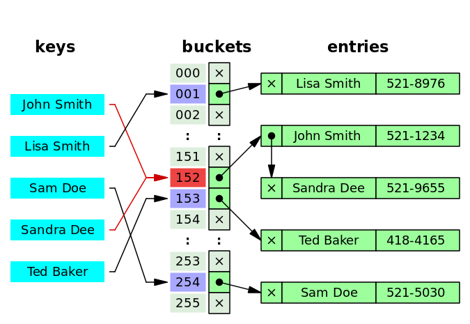
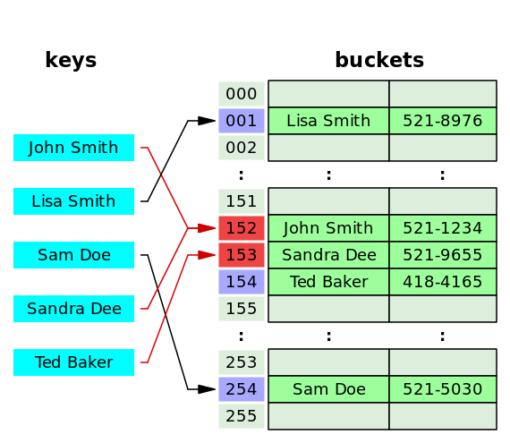

# Hash tables

By [Sobhi Al Khuder](https://github.com/Sob7i?tab=repositories)

## 1- Introduction

> A **hash table (hash map)** is **a data structure that implements an associative array abstract data type, a structure that can map keys to values**. A hash table uses a hash function to compute an index, also called a **hash code**, into **an array of buckets or slots**, from which the desired value can be found.  - [Wikipedia](https://en.wikipedia.org/wiki/Hash_table#:~:text=In%20computing%2C%20a%20hash%20table,desired%20value%20can%20be%20found.).
> 

### **Objects** are **hash tables** in Javascript.

## 2 - Big O for hash table operations:

- lookup → `O(1)`
- Insert  → `O(1)`
- Delete → `O(1)`
- Searching → `O(1)`

## 3 - Hash functions:

3.1 -  A hash function is a function that takes input and generates an encrypted value of fixed length for that input. This function is known as **idempotent,** which means it always outputs the same value of a given input. 

### Hash functions have a time complexity of O(1) depending on the implementation

### 3.2 - Secure Hash Algorithm SHA types :

| Algorithm | Bits Length | Output | Security | Remarks |
| --- | --- | --- | --- | --- |
| SHA-1  | 160 bits / 20 bytes | 40 hexadecimal digits | Less | Used in  SSL certificates |
| SHA-256  | 256 bits / 32 bytes | 64 hexadecimal digits | High | Commonly used in blockchain. |

## 4 - Hash Collisions:

4**.1 -** Sometimes, a hash function can generate the same index for more than one key. This scenario is referred to as a **hash collision.** Collisions are a problem because every slot in a hash table is supposed to store a single element.

### 4.2 - Solutions for hash collision

A search algorithm that uses hashing consists of **two parts**. **The first part is** **computing a hash function** that transforms the search key into an array index. The ideal case is such that no two search keys hashes to the same array index, however, this is not always the case, and is impossible to preclude for unseen given data. **Hence the second part of the algorithm is collision resolution.** The two common methods for collision resolution are **separate chaining** and **open addressing.**

- **Separate Chaining⛓**
    
    In separate chaining, the process involves building a data structure with key-value pair for each address. The collided items are chained together by using different data structures such as a single linked list, a binary tree, or even an array that can be traversed to access the item.
    
    **e.g.** `address 400 : [[”key1”, “value1”], [”key2”, “value2”]].`
    
     
    
    
    
- **Open Addressing 📖**
    
    This is another collision resolution technique in which every entry record is stored in the bucket array itself, and the hash resolution is performed through **probing.** Well-known probe sequences include: 
    
    - [Linear probing](https://en.wikipedia.org/wiki/Linear_probing) in which the interval between probes is **fixed** (usually 1). Because slots are located in **successive locations**, linear probing could lead to better utilization of CPU cache due to the [locality of references](https://en.wikipedia.org/wiki/Locality_of_reference)
    - [Quadratic probing](https://en.wikipedia.org/wiki/Quadratic_probing) is in which the interval between probes is increased by adding the successive outputs of a quadratic polynomial to the starting value given by the original hash computation.
    - [Double hashing](https://en.wikipedia.org/wiki/Double_hashing) in which the interval between probes is computed by a second hash function.
        
        
        
    

## 5 - Hash-map vs Hash-table:

 Both DS provide a key/value functionality but there are a few differences :

| DS | Native DS in JS | Key | Convert to JSON | Handle synchronous updates |
| --- | --- | --- | --- | --- |
| Hashmap | Map | Any data type | No | Bad. limited to single-threaded |
| Hashtable | Object | Integers or strings | Yes | Good. Built-in natively. Can be shared by multiple threads |

## 6- Implement a hash table

[Hash table implementation example](https://replit.com/@Sob7i/Hash-table-implementation-example#index.js:32:10)

```jsx
class HashTable {
  constructor(size) {
    this.data = new Array(size)
  }

  _hash(key) {
    let hash = 0

    for(let i = 0; i < key.length; i++) {
      hash = (hash + key.charCodeAt(i) * i) % 
      this.data.length
    }
 
    return hash
  }

  set(key, value) {
    const address = this._hash(key)
    
    if(!this.data[address]){ 
      this.data[address] = []
  }
    this.data[address].push([ key,value ])
    return this.data
  }
  
  get(key) {
    const address = this._hash(key)
    const currentBucket = this.data[address]

    if(currentBucket) {
      for(let i = 0; i < currentBucket.length; i++) {
        if(currentBucket[i][0] === key) {
          return currentBucket[i][1]
        }
      }
    }
    
    return undefined
  }

	keys() {
    if (!this.data.length) {
      return undefined
    }
    
    const keysArray = []

    for (let i = 0; i < this.data.length; i++) {
      if(this.data[i] && this.data[i].length){
        if (this.data[i].length > 1) {
            for (let j = 0; j < this.data[i].length; j++) {
              keysArray.push(this.data[i][j][0])
            }
        } else {
          keysArray.push(this.data[i][0])
        } 
      }
    }
    
    return keysArray
  }
}

const fruits = new HashTable(2)

// Insertion:
fruits.set('apples', 1000) // O(1) -> Excellent 

// Lookup
fruits.get('apples') // O(1) -> Excellent if no / low collision. Otherwise 
// it might be potentially O(n) 

// Iteration through keys
fruits.keys() // O(n^2) -> Bad 
```

## 7- Google interview question (First recurring number) :

```jsx
const { performance } = require('perf_hooks');

const testCase = Array.from(
	{length: 40000},
	() => Math.floor(Math.random() * 40000)
);

// O(n^2) solution
function findFirstRecurringNum1(array) {
  let timeBefore = performance.now()
  let result = undefined
  let uniqueNums = [] // O(n)
  // O(n)
  for (let i = 0; i < array.length; i++) {
     // O(n)
    const elemExists = uniqueNums.includes(array[i])
    
    if (elemExists) {
      result = array[i]
      break
    }
    else uniqueNums.push(array[i])
  }

  let timeAfter = performance.now()
  console.log(`findFirstRecurringNum1 took ${timeAfter - timeBefore} ms`)
  
  return result
}

const result1 = findFirstRecurringNum1(testCase)
console.log('result1', result1) // Outputs 0.1998 ms 

// O(n) solution
function findFirstRecurringNum2(array) {
  let timeBefore = performance.now()
  let result = undefined
  let uniqueSet = new Set() // O(n)
  
  // O(n)
  for (let i = 0; i < array.length; i++) {
    const elemExists = uniqueSet.has(array[i])  // O(n)
    
    if (elemExists) {
      result = array[i]
      break
    }
    else uniqueSet.add(array[i])
  }

  let timeAfter = performance.now()
  console.log(`findFirstRecurringNum2 took ${timeAfter - timeBefore} ms`)
  
  return result
}

const result2 = findFirstRecurringNum2(testCase)
console.log('result2', result2) // Outputs 0.1097 ms
```

## 8- Notes:

- Hash tables are useful for solving time complexity problems.
- Hash tables are bad for iteration.
- A common side effect of using a hash table to solve time complexity problems is adding space complexity of `O(n)`.
- Hash tables are a good use case for DB operations.
- Good for access, bad for memory.

## 9- Why Hash tables: