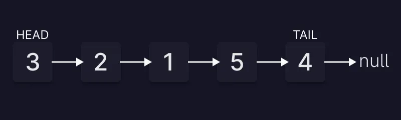

# Linked lists

## 1- introduction

**1.1 -** A linked list is a linear data structure that represents a collection of elements, where each element points to the next one. The first element in the linked list is the head and the last element is the tail.

### **1.2** - **The main properties of a linked list data structure are:**

- `size`: The number of elements in the linked list
- `head`: The first element in the linked list
- `tail`: The last element in the linked list

### **1.3** - **Each element of a linked list must have the following properties:**

- `value`: The value of the element
- `next`: A pointer to the next element in the linked list (`null` if there is none)



## 2- Big O for **linked list** operations:

- Lookup: → `O(n)`
- Search:  → `O(n)`
- Insertion:  → `O(1)`
- Deletion:  → `O(1)`

## Why Linked Lists?

- Linked lists are often used because of their efficient **insertion** and **deletion (O(1) CONSTANT)**. They can be used to implement **stacks**, **queues**, and other abstract data types.
- You don't know **how many items will be in the list**. With arrays, you may need to re-declare and copy memory if the array grows too big
- You don't need **random access (O(n) LINEAR).**
- You want to be able to **insert items in the middle** of the list (such as a **priority queue**)

## Linked list implementation:

```jsx
class Node {
  constructor(value) {
    this.value = value
    this.next = null
  }
}

class LinkdList {
  constructor(value) {
    this.head = new Node(value)
    this.tail = this.head
    this.length = 1
  }

  append(value) {
    const node = new Node(value)
    this.tail.next = node
    this.tail = node
    this.length++

    return this
  }

  prepend(value) {
    const node = new Node(value)
    node.next = this.head
    this.head = node
    this.length++

    return this
  }

  insert(index, value) {
    if (index > this.length) {
      return this.append(value)
    }

    const node = new Node(value)
    const leaderNode = this.#traverseToIndex(index - 1)
    const holdingPointer = leaderNode.next
    leaderNode.next = node
    node.next = holdingPointer

    return this
  }

  remove(index) {
    if (index > this.length) {
      return delete this.tail
    }
    const leaderNode = this.#traverseToIndex(index - 1)
    const currentNode = this.#traverseToIndex(index)
    leaderNode.next = currentNode.next

    return this
  }

  print() {
    const listAsArray = []
    let currNode = this.head

    while (currNode !== null) {
      listAsArray.push(currNode)
      currNode = currNode.next
    }

    return listAsArray
  }
  
  #traverseToIndex(index) {
    let counter = 0
    let currentNode = this.head

    while (counter !== index) {
      currentNode = currentNode.next
      counter++
    }

    return currentNode
  }
}

const myList = new LinkdList(2)

myList.append(3)
myList.append(4)

myList.prepend(1)
myList.prepend(0)

myList.insert(1, 77)
myList.print()

myList.remove(1)
myList.print()
```

## Notes:

- Computers have a built-in caching mechanism that allows them to read data that are stored in contiguous order faster than scattered data.

## TO BE CONTINUED:
- Example of passing by reference
- What is a pointer?
- Singly vs doubly linked list
- Insertion
- Deletion
- Appending
- Prepending
- Searching
